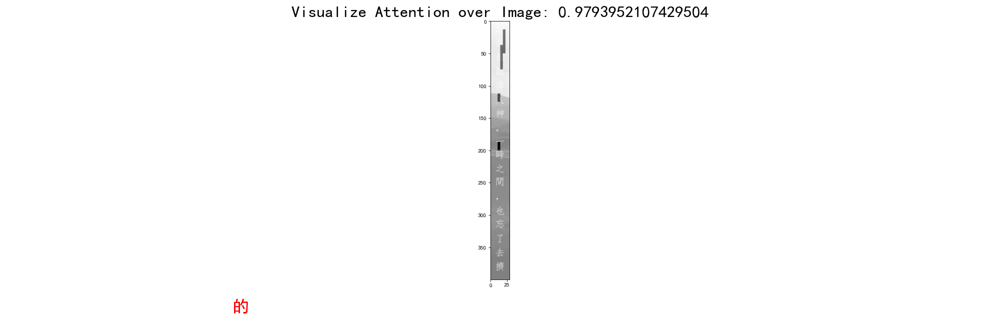

This repository contains the unified implementation of 1-Dimention and 2-Dimention seq2seq-attention network for OCR with pytorch. Also can recognition horizonal and vertical texts with beam search and greedy search strategy.   
At the same time, we trained the network with samples generated by the repository(https://github.com/yangsuhui/text_data_generator) which is also modified by me, this data generation repository can generate varied length、multi-lang、horizonal and vertical texts with random backgrounds.

# requirements
pytorch 0.1.1  

```bash
cd Attention_ocr_recognition
pip install -r requirements.txt
```

# Train 

1-D mode 
```bash
python train.py --trainlist ./data/ch_train.txt --vallist ./data/ch_test.txt --imgH 32 --imgW 280 --experiment ./expr/attention1dcnn --niter 40 --saveInterval 10 --mode 1D --use_beam_search
```

2-D mode
```bash
python train.py --trainlist ./data/train_v.txt --vallist ./data/test_v.txt --imgH 420 --imgW 420 
```


## Datasets

1-D mode:
A small dataset from [Synthetic_Chinese_String_Dataset](https://github.com/chenjun2hao/caffe_ocr), about 270000+ images for training, 20000 images for testing.
download the image data from [Baidu](https://pan.baidu.com/s/1hIurFJ73XbzL-QG4V-oe0w)
with the 1-D datasets above, the model can achive 0.98 accuracy.

2-D mode datasets is generated using the repository (https://github.com/yangsuhui/text_data_generator)
with the 2-D datasets about 10W training data and 5k test data, the model can achive 0.997 accuracy in vertical texts.

the train.txt and test.txt are created as the follow form:
```
path/to/image_name.jpg label
path/AttentionData/images/00000554.png 一份「設計構想」──用的就是
path/AttentionData/images/00001027.png 一排椅子上的那兩個中學生，他就
path/AttentionData/images/00000319.png 來，太激動了！多年來
```

# Inference
The following command is used for 2-D mode, the 1-D mode also can used this command with same hypeparameters modified such as imgH、imgW etc.
```bash
python demo.py --encoder ./expr/attention2dcnn_v_res18/encoder_160.pth --decoder ./expr/attention2dcnn_v_res18/decoder_160.pth --imgH 420 --imgW 420 --img_path ./test_img/2dimg/00004747.png --use_beam_search
```
Download the 2-D model([Baidu](https://pan.baidu.com/s/1FEfiajq8zUqI5xtd1RI2GA), password: q8kp) and using the command above，the visulization of attention results gif will be saved in folder of vis.




# Reference
1. [text_data_generator](https://github.com/yangsuhui/text_data_generator)
2. [Attention-OCR](https://github.com/chenjun2hao/Attention_ocr.pytorch)
3. [Seq2Seq-PyTorch](https://github.com/MaximumEntropy/Seq2Seq-PyTorch)
4. [MaskTextSpotter](https://github.com/MhLiao/MaskTextSpotter)
5. [LaTeX_OCR](https://github.com/LinXueyuanStdio/LaTeX_OCR)


